# Shoot
It is a Responsive Football News App Providing, The Basic Features That Both Admins & Users Need.

# The Features
* Fully Responsive Design Using **Grid System** in **Bootstrap**.

</img>
</img>

* Both Client-Side & Server-Side Validations for All of the Admin Login Data.
* The Admin Login Made Depending on (**Country Code Name**, **Country Code Number**, **Phone Number** & **Password**).
* **Remember Me** Field to Make the Next Login of the Admin Much More Easier.
* **Show Password** Field to Enable the Admin Display his Own Password.

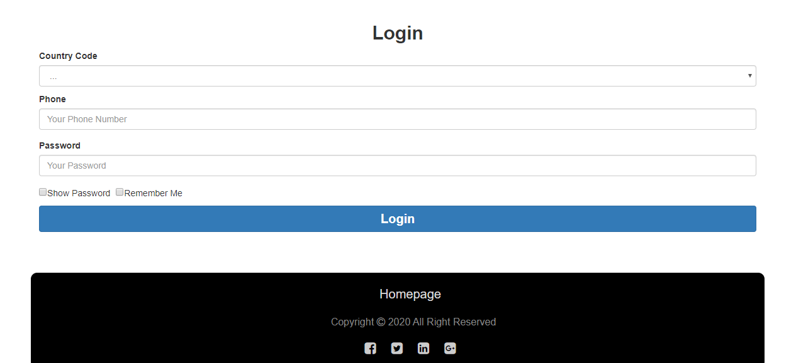</img>

* Responsive & Flexible Dahboard to Make All CRUD Operations on the **News** Module.

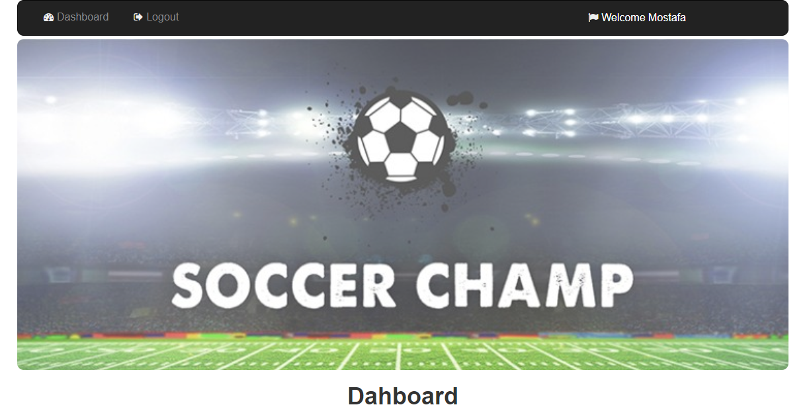</img>

* The Admin Can Show All News.
* The Admin Can Show the Details of any News When it is Selected.

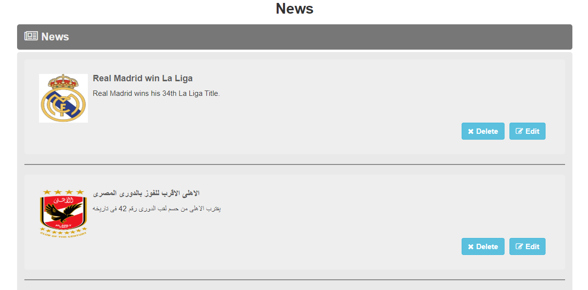</img>

* The Admin Can Add News in Both Arabic & English Languages.

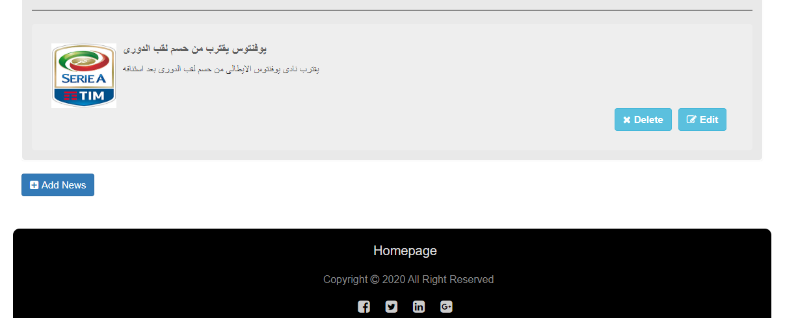</img>

* The News Created by the Admin is Consisted of Language, Title, Description, Writer & Image.

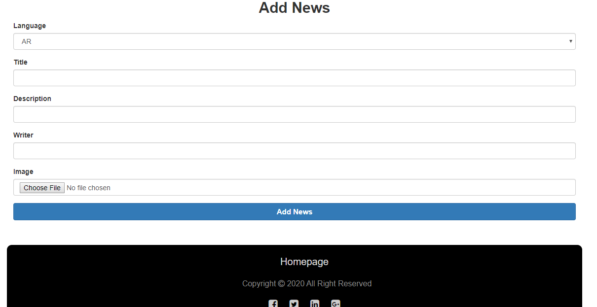</img>

* The Admin Can Edit News.

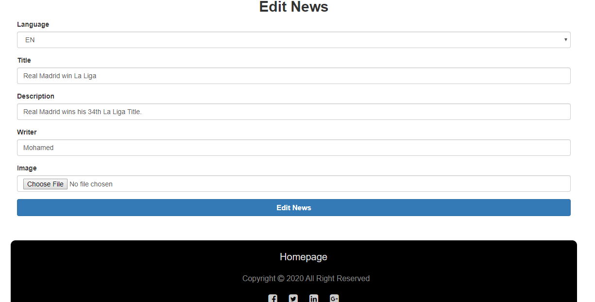</img>

* The Admin Can Delete News.
* **Confirmation Message** on Deleting any News.

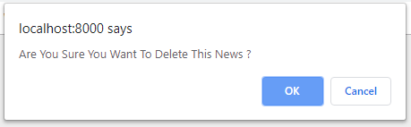</img>

* The Admin Can Control the Number of News That are Being Shown per Page for Users in the Homepage.

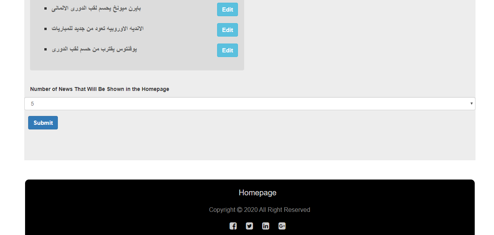</img>

* The Admin Can Show The Latest News.
* The Admin Can Control the Number of the Latest News that are Being Shown to him in his Dashboard.

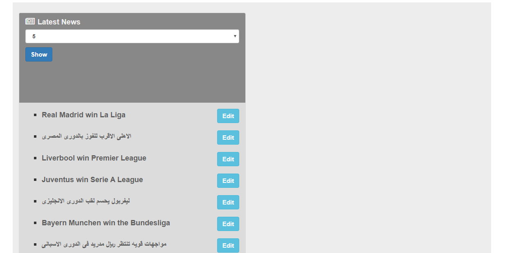</img>

* The Admin Can Show The Total Number of News.
* The Admin Can Show The Total Number of Users.

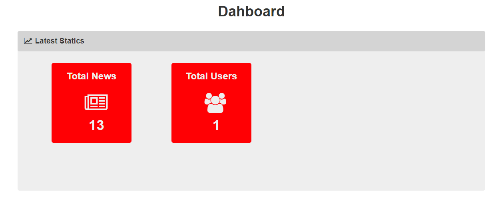</img>

* The User Can Show All News Without Making a Login.

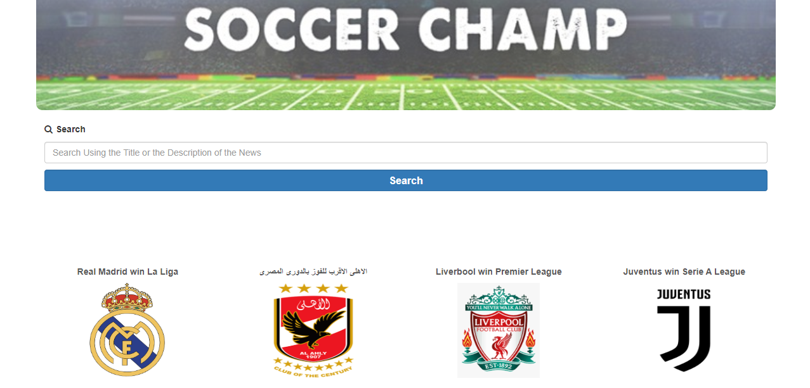</img>

* The User Can Switch Between Arabic & English Languages.

</img>

* The News Will Be Shown According to the Selected Language.
* The Flexible & Real-Time Search Made Depending on **AJAX**.
* The User Can Search for a Specific News Depending on the Title of the News or the Description of it.

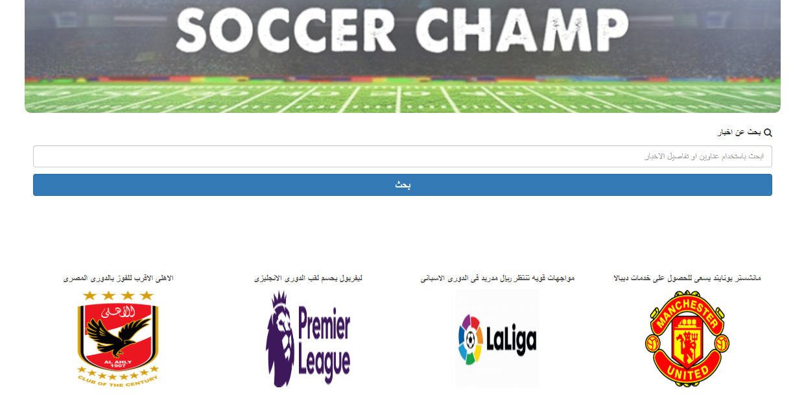</img>
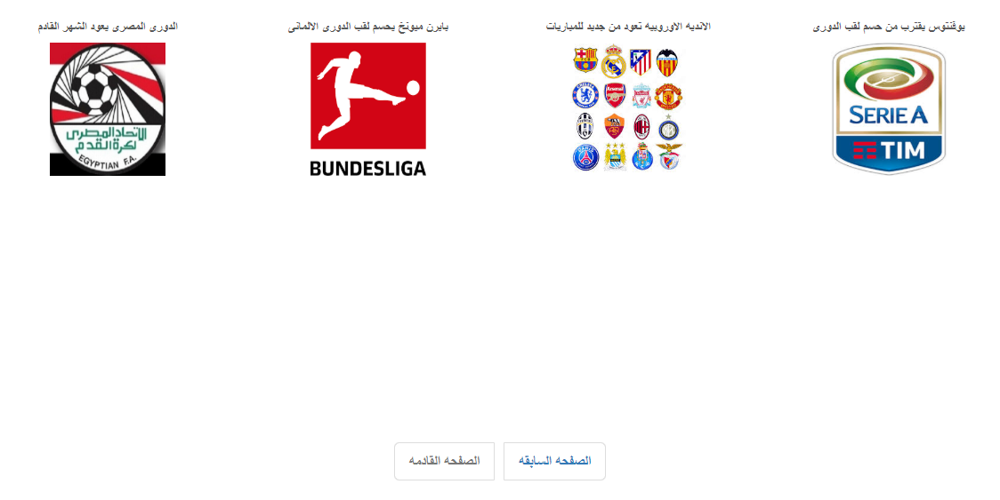</img>

* The User Can Easily Move from One Page to Another Using **Pagination** in (**Bootstrap** & **Laravel**).

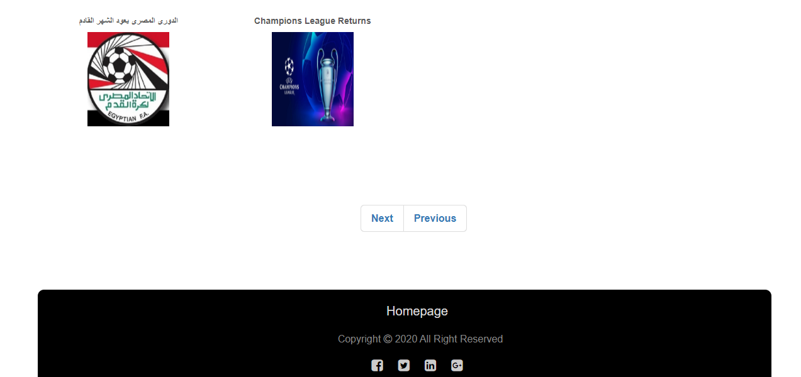</img>
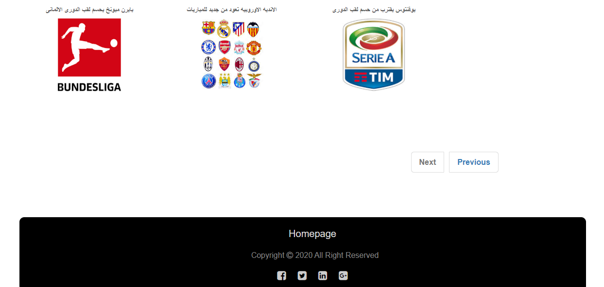</img>
</img>
</img>

# The Used Technologies
* HTML
* HTML5
* CSS
* CSS3
* Font Awesome CSS Library
* JavaScript
* Nice Scroll JS Plugin
* jQuery
* AJAX
* Bootstrap
* PHP
* Laravel
* MySQL DB
